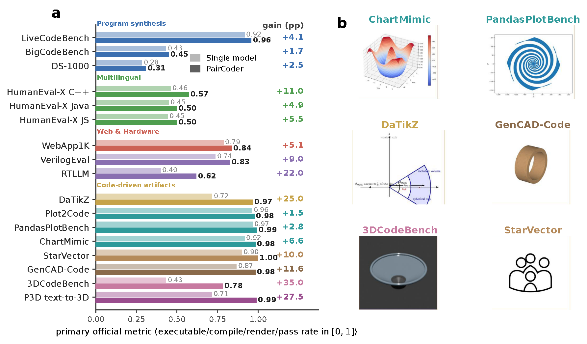

<div align="center">

# PairCoder++: Pair Programming as a Universal Paradigm for Verified Code-Driven Multimodal and Structured-Artifact Generation

<p>
  <a href="https://arxiv.org/abs/2607.01883"></a>
  <a href="http://yisuanwang.github.io/PairCoder"></a>
  <a href="https://github.com/yisuanwang/PairCoder"></a>
  <a href="https://aclanthology.org/2026.findings-acl.149/"></a>
  
</p>

**Junhao Chen**<sup>1</sup>&emsp;
**Xiang Li**<sup>2</sup>&emsp;
**Mingjin Chen**<sup>3</sup>&emsp;
**Boran Zhang**<sup>4</sup>&emsp;
**Henghaofan Zhang**<sup>5</sup><br>
**Yibin Xu**<sup>6</sup>&emsp;
**Yuehan Cui**<sup>7</sup>&emsp;
**Fangsheng Weng**<sup>8</sup>&emsp;
**Fei Ma**<sup>9</sup>&emsp;
**Qi Tian**<sup>9</sup>&emsp;
**Ruqi Huang**<sup>1</sup>&emsp;
**Hao Zhao**<sup>1,10</sup>

<sup>1</sup>Tsinghua University&emsp;·&emsp;<sup>2</sup>Peking University&emsp;·&emsp;<sup>3</sup>The Hong Kong Polytechnic University&emsp;·&emsp;<sup>4</sup>USTC<br>
<sup>5</sup>UESTC&emsp;·&emsp;<sup>6</sup>Tongji University&emsp;·&emsp;<sup>7</sup>Tianjin University&emsp;·&emsp;<sup>8</sup>Independent Researcher&emsp;·&emsp;<sup>9</sup>Guangming Lab&emsp;·&emsp;<sup>10</sup>BAAI

<br>



</div>

> **Two LLM agents, one keyboard.** A *Driver* writes a program; a *Navigator* reviews it against real verification evidence (does it compile? execute? render?) and either accepts it (`[NOERROR]`) or asks for a concrete fix. Roles switch on each error. The result is code that actually *runs* — across Python, web, hardware (Verilog), charts, SVG, CAD, and parametric 3D.

---

## 🔀 Two versions of PairCoder

|  | Scope | Where |
|---|---|---|
| **PairCoder** (ACL 2026 Findings) | The original: pair-programming-inspired two-agent collaboration that improves **code generation** (HumanEval, 13 LLMs). | [ACL Anthology](https://aclanthology.org/2026.findings-acl.149/) |
| **PairCoder++** (this repository) | The extension: the same loop, grounded in the toolchain, generalized to **any task whose output is a code representation** of structured data or multimodal content — **17 benchmarks** spanning scientific figures, charts, vector graphics, CAD, 3D scenes, web apps, and hardware, across **7 models / 3 vendors**. |  this repository |

---

## 📖 Abstract

Code is the medium through which large language models generate structured artifacts: charts, scientific figures, vector graphics, CAD models, 3D scenes, and hardware designs are all produced by writing programs. In this regime single-pass inference is brittle, because the compiler, renderer, or simulator that decides whether the artifact exists is invisible to the model. We present **PairCoder**, which grounds review in the toolchain and realizes it as two-agent pair programming: a **Driver** agent writes the program, a **Navigator** agent reviews it against verification evidence (diagnostics, execution results, and renderings of the current artifact beside the target), and the two switch roles when errors persist. Across 17 public benchmarks and seven models from three vendors, PairCoder improves essentially every benchmark whose artifact is verifiable, on full official metric suites rather than execution alone (for example, Blender scene executability 0.20→0.78; Ti*k*Z compile rate up 10 to 30 points on every model), at 2.9 to 9.2 times single-model cost. The improvements concentrate where the toolchain provides an informative oracle and the baseline leaves headroom, and the method ties or mildly regresses where the oracle is weak — so we frame pair programming as a universal, reliable recipe for verified code-driven generation.

## ✨ Highlights

- **One loop, every code-representable artifact.** The same Driver/Navigator protocol drives Python, matplotlib, Ti*k*Z, SVG, CadQuery, Blender, React, and Verilog — you only swap the verification function.
- **Verification-grounded review.** The Navigator never reviews on vibes: it sees a compiler error, a failing test, an execution trace, or a rendering of the current artifact beside the target. If the evidence passes and it cannot cite a concrete bug, it must return `[NOERROR]` — so PairCoder **never churns already-working code**.
- **Error-triggered role switching.** When a bug is found, the agent that *found* it takes the keyboard, so the fixer and the reviewer of the fix are always different perspectives.
- **Dependency-light framework.** The core (`paircoder/`) needs only an OpenAI-compatible client; credentials come from environment variables — **nothing is hard-coded**.
- **Fully reproducible.** Every number in the paper (17 benchmarks × 7 models) ships with its runner, grader, and scorer under [`reproduction/`](reproduction/).

## 🧠 The idea in 60 seconds

```
            ┌─────────────┐   code C_t    ┌──────────────┐
   task ───▶│   DRIVER    │ ────────────▶ │  NAVIGATOR   │
            │ writes code │               │ reviews code │
            └─────────────┘ ◀──────────── └──────────────┘
                   ▲          REVISE / [NOERROR]   │
                   │                               │ sees verification
                   └────────── role switch ◀───────┘ evidence ψ
                              (on each error)        (compile/run/render)
```

Where a single model's output **fails to run**, PairCoder usually **recovers it**; where the single output already works, PairCoder **leaves it alone** (no regressions).

## 🔧 Install

```bash
git clone https://github.com/yisuanwang/PairCoder.git
cd PairCoder
pip install -e .            # exposes the `paircoder` package (needs: openai, httpx)
```

Python 3.9+ recommended. For the parametric-3D example: `pip install trimesh`.
For reproducing benchmarks, see [`reproduction/README.md`](reproduction/README.md).

## 🔑 Configure your API (one-time)

PairCoder talks to **any OpenAI-compatible endpoint** (OpenAI, vLLM, LM Studio, OpenRouter, Volcano ARK / doubao / deepseek, …). Credentials come from environment variables — nothing is hard-coded.

```bash
export PAIRCODER_API_BASE="https://api.openai.com/v1"   # your endpoint
export PAIRCODER_API_KEY="sk-..."                       # your key
export PAIRCODER_EFFORT=none                            # thinking OFF (paper setting)
```

<details>
<summary>Volcano ARK (doubao-* / deepseek-* models)</summary>

ARK models are routed automatically by name prefix. Set:
```bash
export ARK_API_BASE="https://ark.cn-beijing.volces.com/api/v3"
export ARK_API_KEY="ark-..."
```
For these models PairCoder translates "thinking off" into ARK's `thinking={"type":"disabled"}` for you.
</details>

## 🚀 Hello, PairCoder

The smallest useful example lives in [`examples/quickstart.py`](examples/quickstart.py); it compares the single-model baseline with PairCoder:

```bash
python examples/quickstart.py
```

The essence is a few lines:

```python
from paircoder import paper_solve, single_baseline

# 1) a single LLM call (the baseline):
baseline = single_baseline(question, model="gpt-5.4-mini")

# 2) PairCoder, grounded on YOUR verification function `check`:
code, info = paper_solve(question, model="gpt-5.4-mini", check=check, extract=extract_code)
#   info == {"accepted": True/False, "iters": <#rounds>}
```

The single thing you provide is **`check`** — how to *verify* a candidate. That is the heart of PairCoder: the Navigator reviews against this evidence.

## 📐 The core API

```python
single_baseline(question, model, sys_hint="", image_b64=None) -> str

paper_solve(
    question,                 # the task prompt (include output-format instructions)
    model,                    # any OpenAI-compatible chat model id
    max_iters=4,              # max Driver/Navigator rounds
    check=None,               # callable(code) -> (ok: bool, evidence: str, score: float)
    sys_hint="",              # optional system context for both roles
    extract=None,             # callable(text) -> code, used only for `check`
    image_b64=None,           # optional target image (multimodal tasks)
    render_current=None,      # optional callable(code) -> b64 png of current artifact
) -> (final_code_text, {"accepted": bool, "iters": int})
```

**Writing a good `check`.** It returns a 3-tuple `(ok, evidence, score)`:

```python
def check(code: str):
    try:
        run(code)                 # compile / execute / render
        return (True,  "evidence string the Navigator will read", 1.0)
    except Exception as e:
        return (False, f"{type(e).__name__}: {e}", 0.0)   # the error becomes feedback
```

* `ok` — did it pass the verification you care about?
* `evidence` — a human-readable string (error message, test output, metrics) the Navigator reads verbatim; make it specific.
* `score` — optional `[0,1]` quality (e.g. SSIM, pass-rate). If no round is fully accepted, PairCoder returns the highest-scoring candidate it saw.

## 🎨 Parametric & multimodal generation

*Parametric generation* means the model writes a **program** that builds an artifact — a CAD model, a mesh, a chart, an SVG, a Verilog module — verified by **running that program**. [`examples/parametric_3d.py`](examples/parametric_3d.py) asks a model to write `trimesh` code from an exact spec and verifies it by executing `build()` and checking the mesh. [`examples/run_p3dbench.py`](examples/run_p3dbench.py) wires PairCoder into [P3D-Bench](https://github.com/SpatiaOS/P3D-Bench)'s own compile → score → summarize pipeline.

In every domain you swap only the `check` (and optionally `render_current` for a visual Navigator); the Driver/Navigator loop is unchanged:

| Domain | Artifact / program | `check` evidence |
|---|---|---|
| Charts (Plot2Code, ChartMimic) | matplotlib code → PNG | renders? SSIM/CLIP vs target |
| Vector graphics (StarVector) | SVG code → raster | parses & renders? visual match |
| Hardware (RTLLM, VerilogEval) | Verilog → simulation | compiles & simulates? testbench pass |
| Web (WebApp1K) | React/HTML → DOM | builds & passes UI tests |
| CAD / 3D (P3D-Bench, GenCAD) | CAD program → mesh | builds a valid solid? geometry match |

## ⚙️ Configuration reference

| Variable | Default | Meaning |
|---|---|---|
| `PAIRCODER_API_BASE` | `https://api.openai.com/v1` | OpenAI-compatible endpoint |
| `PAIRCODER_API_KEY` | — | your API key |
| `ARK_API_BASE` / `ARK_API_KEY` | ARK Beijing / — | Volcano ARK (doubao/deepseek) |
| `PAIRCODER_EFFORT` | `none` | reasoning effort; `none` = **thinking off** |
| `PAIRCODER_SWITCH` | `err1` | role-switch policy: `err<eta>`, `fixed<k>`, or `none` |
| `PAIRCODER_MODE` | — | set `selfrefine` for the single-agent ablation |
| `PAIRCODER_MAX_CONC` | `8` | max concurrent API calls |
| `PAIRCODER_HTTP_TIMEOUT` | `75` | per-request timeout (s) |
| `PAIRCODER_TOKLOG` | — | path to dump a JSON token tally at exit |

## 📊 Results

PairCoder improves code generation across program synthesis **and** structured / multimodal artifacts. On the parametric-3D benchmark **P3D-Bench** (text→CAD, 400 cases, thinking off), it pushes executable validity toward saturation and improves *every* geometry and topology sub-metric on *every* model (single → **PairCoder**):

| Model | valid ↑ | geometry ↑ | F@0.05 ↑ | topology ↑ |
|---|---|---|---|---|
| `gpt-5.4-mini` | 0.973 → **1.000** | 0.600 → **0.618** | 0.746 → **0.767** | 0.968 → **0.995** |
| `gpt-5.4` | 0.715 → **0.990** | 0.347 → **0.483** | 0.443 → **0.619** | 0.708 → **0.983** |
| `gpt-5.5` | 0.672 → **0.943** | 0.321 → **0.438** | 0.419 → **0.570** | 0.669 → **0.938** |
| `doubao-1.5-lite` | 0.140 → **0.427** | 0.073 → **0.218** | 0.094 → **0.275** | 0.136 → **0.416** |
| `doubao-seed-2.0-mini` | 0.812 → **0.990** | 0.419 → **0.497** | 0.537 → **0.633** | 0.808 → **0.985** |
| `deepseek-v3.2` | 0.950 → **0.993** | 0.549 → **0.576** | 0.682 → **0.714** | 0.946 → **0.989** |
| `deepseek-v4-flash` | 0.945 → **1.000** | 0.581 → **0.611** | 0.727 → **0.764** | 0.943 → **0.998** |

The same pattern holds across the multimodal artifact benchmarks (`gpt-5.4-mini`, thinking off; single → **PairCoder**):

| Benchmark | Metric | Single → PairCoder |
|---|---|---|
| DaTikZ (caption→Ti*k*Z) | compile rate ↑ | 0.500 → **0.633** |
| Plot2Code (image→matplotlib) | execution rate ↑ | 0.841 → **0.962** |
| PandasPlotBench (data→matplotlib) | execution rate ↑ | 0.789 → **0.851** |
| ChartMimic (chart→matplotlib) | execution rate ↑ | 0.967 → 0.967 (saturated tie) |
| StarVector (image→SVG) | render rate ↑ | 0.983 → **1.000** |
| GenCAD-Code (image→CadQuery) | execution ↑ / Chamfer ↓ | 0.900 → **0.983** / 0.233 → **0.166** |
| 3DCodeBench (text→Blender) | executability ↑ / Chamfer ↓ | 0.200 → **0.783** / 4.85 → **2.62** |

Across all **17 benchmarks × 7 models**, gains concentrate where the toolchain gives an informative oracle and the baseline leaves headroom; PairCoder ties at saturated oracles (e.g. ChartMimic) and does **not** regress already-valid programs, at 2.9–9.2× single-model token cost. Every number ships with its exact runner, grader, and scorer — see [`reproduction/README.md`](reproduction/README.md) for per-benchmark commands, datasets, and toolchains.

## 📁 Repository layout

```
PairCoder/
├── README.md
├── LICENSE                 ← MIT
├── pyproject.toml          ← pip install -e .
├── requirements.txt
├── assets/teaser.png
├── paircoder/              ← the framework (this is all you import)
│   ├── __init__.py         ← paper_solve, single_baseline, ...
│   ├── loop.py             ← the Driver/Navigator loop (Algorithm 1)
│   └── client.py           ← OpenAI-compatible client (env-based, no secrets)
├── examples/
│   ├── quickstart.py       ← 30-line "hello world"
│   ├── parametric_3d.py    ← PairCoder on a CAD/3D task (self-contained)
│   └── run_p3dbench.py     ← reference P3D-Bench integration
└── reproduction/           ← runners / graders / scorers for all 17 benchmarks
    ├── README.md           ← per-benchmark reproduction guide
    └── requirements-repro.txt
```

## 📌 Citation

PairCoder++ extends our ACL 2026 Findings paper. Please cite:

```bibtex
@inproceedings{chen2026paircoder,
  title     = {PairCoder: Pair Programming-Inspired Two-Agent Collaboration for Code Generation},
  author    = {Chen, Junhao and Li, Xiang and Xu, Yibin and Cui, Yuehan and Weng, Fangsheng and Zhao, Hao and Ma, Fei and Tian, Qi},
  booktitle = {Findings of the Association for Computational Linguistics: ACL 2026},
  pages     = {3043--3058},
  year      = {2026}
}
```

## 🔗 Links

- **PairCoder++ paper (arXiv):** https://arxiv.org/abs/2607.01883
- **Original PairCoder (ACL 2026 Findings):** https://aclanthology.org/2026.findings-acl.149/
- **Project Page:** http://yisuanwang.github.io/PairCoder
- **Code:** https://github.com/yisuanwang/PairCoder

## 📄 License

Released under the [MIT License](LICENSE). Any third-party benchmark or dataset you connect (e.g. P3D-Bench, Text2CAD, DaTikZ, ChartMimic) keeps its own license — check it before redistribution.
